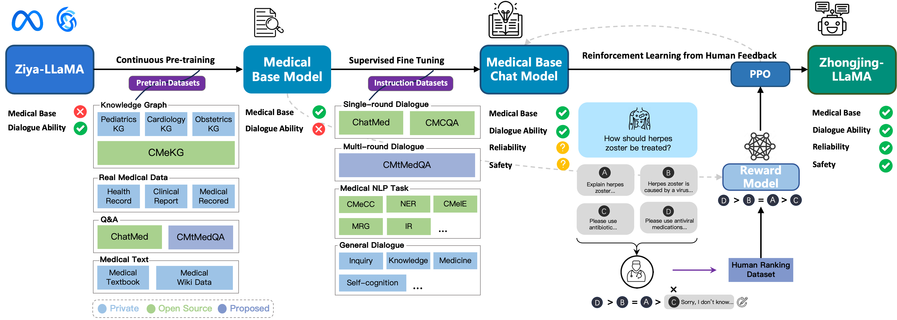
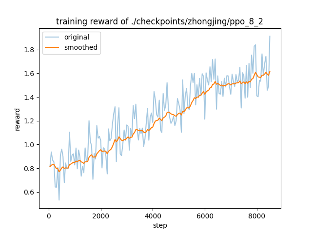
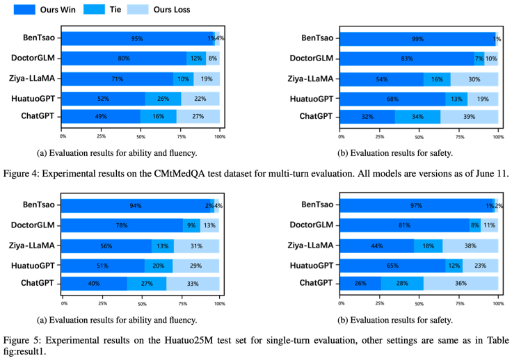

[**中文**](./README.md) | [**English**](./README_EN.md)

# Zhongjing: Enhancing Chinese Medical Capabilities of Large Language Models through Expert Feedback and Real-world Multi-turn Dialogues

<div align="center">
  
</div>

## Overview

Recent advancements in large language models, such as ChatGPT, have demonstrated remarkable performance across various domains. However, these models often struggle in specialized domains like medicine due to the complexity and nuanced expertise required. Although some Chinese medical large models have emerged, they primarily involve fine-tuning base models on single-turn medical dialogues of varying quality, resulting in limited improvements.

Zhongjing-LLaMA represents a pioneering effort in developing a Chinese medical large model that undergoes a complete training pipeline of pre-training, supervised fine-tuning, and reinforcement learning with human feedback (RLHF). It outperforms previous Chinese medical models significantly, even approaching the expertise of professional medical practitioners in certain dialogue scenarios.

Moreover, we curated a dataset containing 70,000 multi-turn dialogues entirely sourced from real medical conversations. This dataset includes a substantial number of doctor-initiated questions, contributing to the model's proactive medical inquiry capabilities.

For more details on our work, please refer to our paper: [Zhongjing: Enhancing Chinese Medical Capabilities of Large Language Models through Expert Feedback and Real-world Multi-turn Dialogues](https://arxiv.org/abs/2308.03549).

## Updates

- [x] [8-10] Uploaded the paper
- [x] [8-13] Uploaded the test set, disclosed training methods and procedures
- [ ] Uploaded pre-trained dialog model
- [ ] Released complete Chinese medical dialogue dataset CMtMedQA

## Methodology

The training process of Zhongjing is illustrated in the following diagram:



## Model

- [ ] Our model will be released shortly

## Training Process

Pre-training loss visualization:


In the RLHF phase, training of the Reward Model and PPO is demonstrated in the following plots:




All training processes exhibit effective convergence.

## Data

- CMtMedQA: A dataset of 70,000 multi-turn dialogues sourced from real doctor-patient interactions.
- [CMtMedQA_test](https://huggingface.co/datasets/Suprit/CMtMedQA_test_v1): A test set of 1000 dialogues for evaluating the model's multi-turn dialogue capabilities, including 200 dialogues for evaluating its response to induced attacks and extreme questions related to Chinese medical safety.

## Evaluation Results

A combined evaluation utilizing GPT-4 and expert medical practitioners assesses the model's dialogue capabilities in terms of safety, professionalism, and fluency. The evaluation results are presented below:



## Limitations Statement

Despite achieving notable performance in Chinese medical capabilities, the model still has room for improvement in terms of safety and professionalism. It may still yield unexpected responses in certain scenarios.

## Acknowledgements

- Special thanks to [hiyouga](https://github.com/hiyouga/LLaMA-Efficient-Tuning) for the LLaMA fine-tuning framework.
- This project builds upon [Ziya-LLaMA](https://huggingface.co/IDEA-CCNL/Ziya-LLaMA-13B-v1).
- Gratitude to the creators of the [CMed](https://github.com/Ziya-LLaMA) dataset.

## Citation

If you wish to cite this work, please use the following format:

```plaintext
@article{yang2023zhongjing,
  title={Zhongjing: Enhancing Chinese Medical Capabilities of Large Language Models through Expert Feedback and Real-world Multi-turn Dialogues},
  author={Yang, Songhua and Zhao, Hanjia and Zhu, Senbin and Zhou, Guangyu and Xu, Hongfei and Jia, Yuxiang and Zan, Hongying},
  journal={arXiv preprint arXiv:2308.03549},
  year={2023}
}
